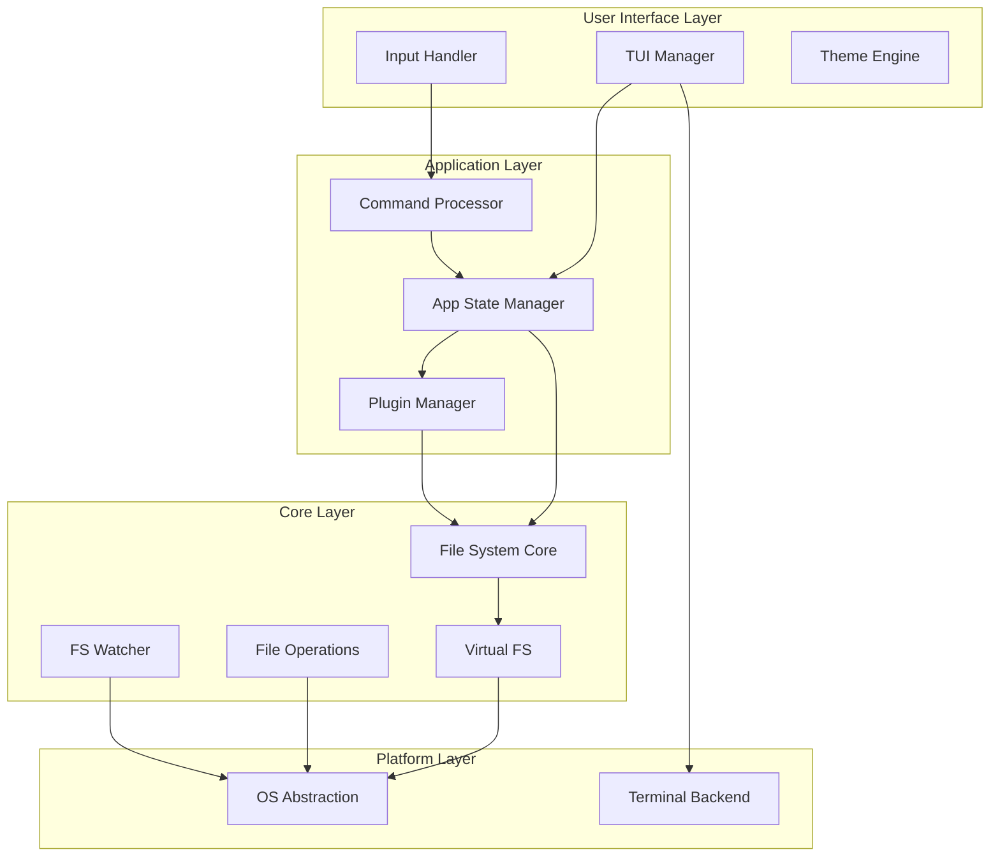

# Cortex File Manager - Architecture Plan

## Executive Summary
Cortex is a high-performance, cross-platform orthodox file manager with a modern terminal user interface. Built with Rust for performance and safety, it combines the power of traditional dual-panel file managers with modern development practices and extensibility.

## 1. Technology Stack Recommendation

### Core Technology: **Rust**
**Justification:**
- **Performance**: Zero-cost abstractions, no garbage collection overhead
- **Memory Safety**: Prevents segfaults and data races at compile time
- **Cross-Platform**: Excellent cross-platform support with single codebase
- **Modern Tooling**: Cargo for dependency management and building
- **Binary Size**: Produces small, standalone binaries
- **Async Support**: Tokio for high-performance async I/O operations

### UI Framework: **Ratatui**
**Justification:**
- Modern TUI framework for Rust
- Immediate mode rendering for performance
- Rich widget library
- Active community and maintenance
- Crossterm backend for cross-platform terminal manipulation

### Key Dependencies:
```toml
# Core dependencies
ratatui = "0.26"           # TUI framework
crossterm = "0.27"         # Terminal manipulation
tokio = "1.35"             # Async runtime
walkdir = "2.4"            # Efficient directory traversal
notify = "6.1"             # File system notifications
serde = "1.0"              # Serialization
toml = "0.8"               # Configuration files
directories = "5.0"         # Platform-specific paths
anyhow = "1.0"             # Error handling
thiserror = "1.0"          # Custom error types

# Archive support
zip = "0.6"
tar = "0.4"
flate2 = "1.0"             # gzip support

# Plugin system
mlua = "0.9"               # Lua scripting for plugins
libloading = "0.8"         # Dynamic library loading

# Optional features
syntect = "5.1"            # Syntax highlighting for viewer
fuzzy-matcher = "0.3"      # Fuzzy search
```

## 2. Project Structure

```
cortex/
├── Cargo.toml                 # Workspace configuration
├── README.md
├── LICENSE
├── docs/
│   ├── architecture.md
│   ├── plugin-api.md
│   └── user-guide.md
│
├── cortex-core/               # Core library
│   ├── Cargo.toml
│   └── src/
│       ├── lib.rs
│       ├── fs/               # File system operations
│       │   ├── mod.rs
│       │   ├── operations.rs # Copy, move, delete
│       │   ├── watcher.rs    # File system monitoring
│       │   └── vfs.rs        # Virtual file system abstraction
│       ├── models/            # Data models
│       │   ├── mod.rs
│       │   ├── entry.rs      # File/directory entry
│       │   ├── panel.rs      # Panel state
│       │   └── selection.rs  # Selection management
│       └── utils/
│           ├── mod.rs
│           ├── size.rs       # Human-readable sizes
│           └── permissions.rs # Permission handling
│
├── cortex-tui/                # Terminal UI
│   ├── Cargo.toml
│   └── src/
│       ├── lib.rs
│       ├── app.rs            # Main application state
│       ├── ui/
│       │   ├── mod.rs
│       │   ├── panel.rs      # File panel widget
│       │   ├── command.rs    # Command line widget
│       │   ├── viewer.rs     # File viewer widget
│       │   ├── dialog.rs     # Dialog system
│       │   └── theme.rs      # Theme management
│       ├── input/
│       │   ├── mod.rs
│       │   ├── keyboard.rs   # Keyboard handling
│       │   └── mouse.rs      # Mouse support
│       └── layout/
│           ├── mod.rs
│           └── manager.rs    # Layout management
│
├── cortex-plugins/            # Plugin system
│   ├── Cargo.toml
│   └── src/
│       ├── lib.rs
│       ├── api.rs            # Plugin API
│       ├── loader.rs         # Plugin loading
│       ├── lua/              # Lua scripting support
│       │   ├── mod.rs
│       │   └── bindings.rs
│       └── native/           # Native plugin support
│           ├── mod.rs
│           └── ffi.rs
│
├── cortex-cli/                # CLI executable
│   ├── Cargo.toml
│   └── src/
│       ├── main.rs
│       ├── config.rs         # Configuration management
│       └── commands.rs       # CLI argument parsing
│
├── plugins/                   # Built-in plugins
│   ├── archive/              # Archive operations
│   ├── git/                  # Git integration
│   ├── search/               # Advanced search
│   └── preview/              # File previews
│
└── tests/
    ├── integration/
    └── benchmarks/
```

## 3. Core Architecture Design

### Component Architecture



### Key Interfaces

```rust
// Core file system trait
pub trait FileSystem: Send + Sync {
    async fn list_entries(&self, path: &Path) -> Result<Vec<Entry>>;
    async fn copy(&self, src: &Path, dst: &Path) -> Result<()>;
    async fn move_entry(&self, src: &Path, dst: &Path) -> Result<()>;
    async fn delete(&self, path: &Path) -> Result<()>;
    async fn create_dir(&self, path: &Path) -> Result<()>;
    async fn get_metadata(&self, path: &Path) -> Result<Metadata>;
}

// Panel trait for extensibility
pub trait Panel: Send + Sync {
    fn update(&mut self, entries: Vec<Entry>);
    fn handle_input(&mut self, key: KeyEvent) -> Action;
    fn render(&self, frame: &mut Frame, area: Rect);
    fn get_selection(&self) -> &Selection;
}

// Plugin trait
pub trait Plugin: Send + Sync {
    fn name(&self) -> &str;
    fn version(&self) -> &str;
    fn initialize(&mut self, context: PluginContext) -> Result<()>;
    fn on_command(&mut self, cmd: &str, args: Vec<String>) -> Result<()>;
    fn on_file_selected(&mut self, entry: &Entry) -> Result<()>;
}
```

### Data Flow

1. **Input Processing**:
   ```
   Terminal Input → Crossterm → Input Handler → Command Processor → App State
   ```

2. **File Operations**:
   ```
   User Command → Command Processor → File Operation Queue → Async Executor → OS Operations
   ```

3. **UI Rendering**:
   ```
   App State → Layout Manager → Widget Renderer → Ratatui → Terminal Output
   ```

## 4. Plugin Architecture

### Plugin Types

1. **Lua Scripts** (Recommended for most plugins)
   - Safe sandboxed execution
   - Hot-reloadable
   - Access to simplified API
   - Example: custom viewers, filters, commands

2. **Native Plugins** (For performance-critical features)
   - Compiled Rust libraries
   - Full API access
   - Dynamic loading via libloading
   - Example: image previews, advanced search

### Plugin API Design

```rust
// Plugin context provided to all plugins
pub struct PluginContext {
    pub fs: Arc<dyn FileSystem>,
    pub ui: Arc<Mutex<UiManager>>,
    pub config: Arc<Config>,
    pub events: Arc<EventBus>,
}

// Event system for plugin communication
pub enum PluginEvent {
    FileSelected(PathBuf),
    FileOperation(OperationType, Vec<PathBuf>),
    CommandExecuted(String, Vec<String>),
    PanelChanged(PanelId),
}

// Lua API bindings
mod lua_api {
    pub fn register_command(name: String, handler: Function);
    pub fn add_menu_item(menu: String, item: MenuItem);
    pub fn show_dialog(dialog: Dialog) -> DialogResult;
    pub fn get_selected_files() -> Vec<String>;
    pub fn execute_operation(op: Operation) -> Result<()>;
}
```

### Plugin Loading Strategy

```rust
// Plugin discovery and loading
pub struct PluginManager {
    lua_runtime: Lua,
    native_plugins: HashMap<String, Box<dyn Plugin>>,
    plugin_paths: Vec<PathBuf>,
}

impl PluginManager {
    pub async fn load_plugins(&mut self) -> Result<()> {
        // 1. Load built-in plugins
        self.load_builtin_plugins()?;
        
        // 2. Load from system directories
        self.scan_plugin_directories(&[
            "/usr/share/cortex/plugins",
            "/usr/local/share/cortex/plugins",
        ])?;
        
        // 3. Load from user directory
        let user_plugins = directories::BaseDirs::new()
            .map(|dirs| dirs.config_dir().join("cortex/plugins"));
        
        // 4. Initialize all plugins
        self.initialize_all()?;
        
        Ok(())
    }
}
```

## 5. Build and Distribution Strategy

### Build Pipeline

```yaml
# GitHub Actions workflow
name: Build and Release
on:
  push:
    tags: ['v*']

jobs:
  build:
    strategy:
      matrix:
        include:
          - os: ubuntu-latest
            target: x86_64-unknown-linux-gnu
          - os: ubuntu-latest
            target: x86_64-unknown-linux-musl
          - os: macos-latest
            target: x86_64-apple-darwin
          - os: macos-latest
            target: aarch64-apple-darwin
          - os: windows-latest
            target: x86_64-pc-windows-msvc
    
    steps:
      - uses: actions/checkout@v3
      - uses: actions-rs/toolchain@v1
      - run: cargo build --release --target ${{ matrix.target }}
      - run: cargo test --target ${{ matrix.target }}
      - name: Package
        run: |
          # Create distribution package with binary and plugins
          mkdir -p dist/cortex
          cp target/${{ matrix.target }}/release/cortex dist/cortex/
          cp -r plugins/built-in dist/cortex/plugins
          tar czf cortex-${{ matrix.target }}.tar.gz -C dist cortex
```

### Distribution Channels

1. **Package Managers**:
   ```bash
   # Homebrew (macOS/Linux)
   brew install cortex
   
   # APT (Debian/Ubuntu)
   sudo apt install cortex
   
   # DNF (Fedora)
   sudo dnf install cortex
   
   # Winget (Windows)
   winget install cortex
   
   # Cargo (Cross-platform)
   cargo install cortex
   ```

2. **Standalone Binaries**:
   - GitHub Releases with pre-built binaries
   - Automatic updates via self-update feature
   - Portable mode (no installation required)

3. **Container Images**:
   ```dockerfile
   FROM alpine:latest
   RUN apk add --no-cache libc6-compat
   COPY cortex /usr/local/bin/
   ENTRYPOINT ["cortex"]
   ```

## 6. Development Phases/Milestones

### Phase 1: Core Foundation (Weeks 1-4)
- [x] Project setup and CI/CD pipeline
- [ ] Basic TUI framework with dual panels
- [ ] File system abstraction layer
- [ ] Basic navigation (up/down, enter directories)
- [ ] Configuration system

### Phase 2: Essential Operations (Weeks 5-8)
- [ ] Copy/Move/Delete operations
- [ ] Async operation queue with progress
- [ ] File selection (space, insert, patterns)
- [ ] Command line integration
- [ ] Basic keyboard shortcuts

### Phase 3: Enhanced Features (Weeks 9-12)
- [ ] File viewer with syntax highlighting
- [ ] Search functionality (name, content)
- [ ] Archive support (browse, extract, create)
- [ ] File system watcher for auto-refresh
- [ ] Theme system

### Phase 4: Plugin System (Weeks 13-16)
- [ ] Lua scripting engine integration
- [ ] Plugin API implementation
- [ ] Native plugin support
- [ ] Built-in plugins (git, preview)
- [ ] Plugin marketplace infrastructure

### Phase 5: Polish & Performance (Weeks 17-20)
- [ ] Performance optimization
- [ ] Memory usage optimization
- [ ] Comprehensive keyboard shortcuts
- [ ] Mouse support
- [ ] Documentation and tutorials

### Phase 6: Platform Integration (Weeks 21-24)
- [ ] Platform-specific features (trash, clipboard)
- [ ] Package manager submissions
- [ ] Auto-update mechanism
- [ ] Telemetry (opt-in) for usage analytics
- [ ] Beta testing and bug fixes

## 7. Testing Strategy

### Testing Levels

1. **Unit Tests**:
   ```rust
   #[cfg(test)]
   mod tests {
       use super::*;
       
       #[tokio::test]
       async fn test_file_copy() {
           let fs = MockFileSystem::new();
           let result = fs.copy(Path::new("/src"), Path::new("/dst")).await;
           assert!(result.is_ok());
       }
   }
   ```

2. **Integration Tests**:
   ```rust
   // tests/integration/file_operations.rs
   #[test]
   fn test_dual_panel_sync() {
       let mut app = TestApp::new();
       app.navigate_left("/home");
       app.navigate_right("/tmp");
       app.copy_selection();
       assert_eq!(app.right_panel().entries().len(), 1);
   }
   ```

3. **UI Tests**:
   ```rust
   // Using ratatui's test backend
   #[test]
   fn test_panel_rendering() {
       let mut terminal = TestTerminal::new(80, 24);
       let app = App::new();
       terminal.draw(|f| app.render(f));
       assert_snapshot!(terminal.buffer());
   }
   ```

4. **Performance Benchmarks**:
   ```rust
   use criterion::{black_box, criterion_group, Criterion};
   
   fn benchmark_directory_listing(c: &mut Criterion) {
       c.bench_function("list 10k files", |b| {
           b.iter(|| {
               list_entries(black_box(Path::new("/large/dir")))
           })
       });
   }
   ```

### Testing Infrastructure

- **CI/CD**: Run tests on every commit
- **Cross-platform**: Test on Windows, macOS, Linux
- **Fuzzing**: Use cargo-fuzz for input handling
- **Property Testing**: Use proptest for operations
- **Coverage**: Maintain >80% code coverage

## 8. Performance Optimization Approach

### Key Strategies

1. **Lazy Loading**:
   ```rust
   // Only load visible entries
   pub struct LazyPanel {
       viewport: Range<usize>,
       entries: Vec<Entry>,
       total_count: usize,
   }
   ```

2. **Virtual Scrolling**:
   - Render only visible items
   - Maintain scroll position efficiently
   - Pre-fetch adjacent items

3. **Async Operations**:
   ```rust
   // Non-blocking file operations
   pub async fn copy_files(files: Vec<PathBuf>) {
       let semaphore = Arc::new(Semaphore::new(4)); // Limit concurrent ops
       let tasks = files.into_iter().map(|file| {
           let sem = semaphore.clone();
           tokio::spawn(async move {
               let _permit = sem.acquire().await;
               copy_file_async(file).await
           })
       });
       futures::future::join_all(tasks).await;
   }
   ```

4. **Memory Management**:
   - Use Arc for shared data
   - Implement entry pooling for large directories
   - Cache frequently accessed metadata

5. **Rendering Optimization**:
   ```rust
   // Differential rendering
   pub struct DiffRenderer {
       last_state: WidgetState,
       
       pub fn render(&mut self, state: &WidgetState) -> RenderOps {
           let diff = self.calculate_diff(state);
           self.last_state = state.clone();
           diff
       }
   }
   ```

### Performance Targets

- **Startup Time**: <100ms
- **Directory Listing**: <50ms for 10,000 entries
- **File Copy**: Saturate I/O bandwidth
- **UI Responsiveness**: 60 FPS minimum
- **Memory Usage**: <50MB for typical usage

### Profiling and Monitoring

```rust
// Built-in performance monitoring
pub struct PerformanceMonitor {
    metrics: HashMap<String, Duration>,
    
    pub fn measure<F, R>(&mut self, name: &str, f: F) -> R 
    where F: FnOnce() -> R {
        let start = Instant::now();
        let result = f();
        self.metrics.insert(name.to_string(), start.elapsed());
        result
    }
}
```

## 9. Security Considerations

### Security Measures

1. **Sandboxed Plugins**:
   - Lua scripts run in restricted environment
   - Limited file system access
   - No network access by default

2. **Safe File Operations**:
   - Validate all paths
   - Prevent directory traversal attacks
   - Use OS-level permissions

3. **Secure Configuration**:
   - Encrypt sensitive data
   - Validate configuration files
   - Safe default settings

## 10. Extensibility Points

### Custom Viewers
```rust
pub trait Viewer {
    fn can_view(&self, entry: &Entry) -> bool;
    fn view(&self, entry: &Entry) -> ViewerWidget;
}
```

### Custom Commands
```rust
pub trait Command {
    fn name(&self) -> &str;
    fn execute(&self, args: Vec<String>) -> Result<()>;
}
```

### Custom Panels
```rust
pub trait CustomPanel: Panel {
    fn panel_type(&self) -> PanelType;
    fn create_config(&self) -> PanelConfig;
}
```

## 11. Configuration System

### Configuration File Structure
```toml
# ~/.config/cortex/config.toml

[general]
theme = "dark"
confirm_delete = true
show_hidden = false
case_sensitive_search = false

[panels]
default_path = "~"
sort_by = "name"  # name, size, modified, extension
sort_reverse = false

[keys]
# Norton Commander compatible defaults
copy = "F5"
move = "F6"
create_dir = "F7"
delete = "F8"
quit = "F10"
view = "F3"
edit = "F4"

[plugins]
enabled = ["git", "archive", "preview"]
auto_update = true

[performance]
max_entries_load = 10000
cache_size_mb = 100
concurrent_operations = 4
```

## 12. Example Plugin Implementation

### Git Status Plugin (Lua)
```lua
-- plugins/git_status.lua
local git = require("cortex.git")
local ui = require("cortex.ui")

function on_directory_changed(path)
    if git.is_repository(path) then
        local status = git.get_status(path)
        ui.set_status_line(string.format("Git: %s", status.branch))
        
        -- Color files based on git status
        for _, entry in ipairs(cortex.get_entries()) do
            local file_status = status.files[entry.name]
            if file_status == "modified" then
                entry.color = "yellow"
            elseif file_status == "new" then
                entry.color = "green"
            elseif file_status == "deleted" then
                entry.color = "red"
            end
        end
    end
end

cortex.register_hook("directory_changed", on_directory_changed)
```

## Conclusion

Cortex's architecture prioritizes performance, extensibility, and user experience. The use of Rust ensures memory safety and performance, while the plugin system allows for unlimited customization. The modular design enables independent development of components and easy maintenance.

### Key Success Factors:
1. **Performance First**: Every design decision prioritizes speed
2. **Plugin Ecosystem**: Extensibility attracts developers
3. **Cross-Platform**: Single codebase, native performance
4. **Modern UX**: Clean, intuitive interface despite being terminal-based
5. **Orthodox Heritage**: Respects file manager traditions while innovating

### Next Steps:
1. Set up project repository and CI/CD
2. Implement core file system abstraction
3. Build basic TUI with dual panels
4. Create MVP with essential operations
5. Gather community feedback and iterate